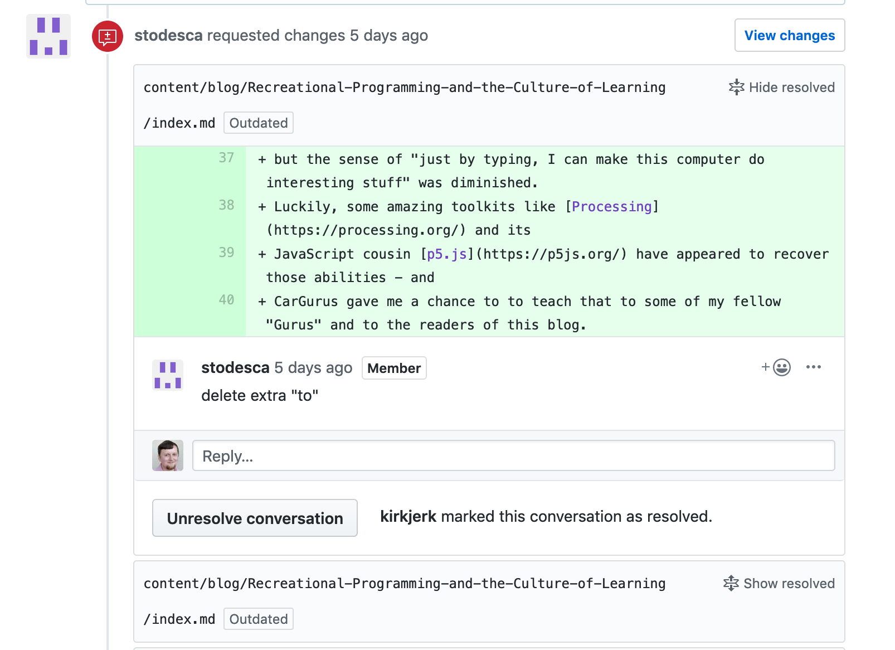
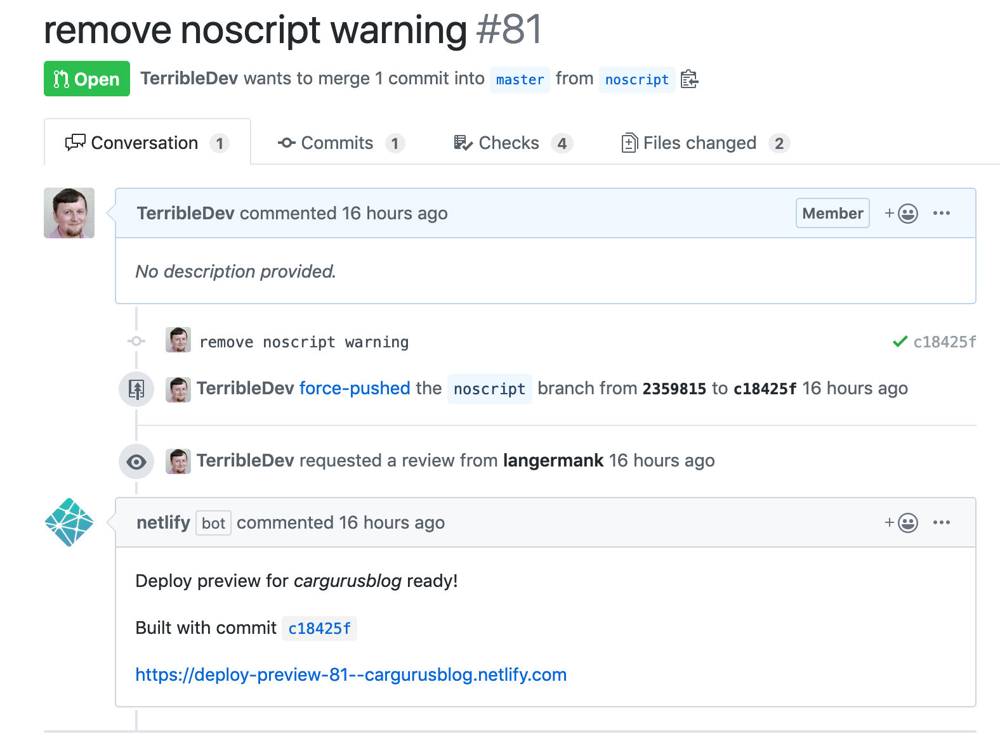

Several months ago we decided to start documenting our journey as an engineering organization. We're the largest automotive market place, and sounds like fancy marketing lingo, but the simple reality is we're a big 14 year old, publicly traded entity. We have millions of users, shareholders, and regulatory bodies we have to keep in mind.

Companies the size of ours need to control our public image. We can't just let any text under our brand exist. So for us, putting out blogs by engineers comes with a risk. Controlling that risk is key, but **any** barriers to authoring content **will** discourage people from writing. Since we've got a high profile image, we decided all posts would be reviewed by our PR and marketing teams.

## Medium, and the lessons we learned

At first the drive to post content came from both our marketing, and recruiting teams. With zero public facing content we had a hard time recruiting, and even conveying to the public that we are a technology first company. 

Since the idea to blog started in marketing, the technologies, and processes we first chose we're possible to implement, without a computer science background. The basic workflow was to author posts in google docs, have them peer-reviewed in google docs, and then the post would be pasted into medium. 

Google docs, is a pretty awesome technology. However the co-authoring experience leaves a lot to be desired. Google docs can't enforce a standard document layout, the content is not very portable, and managing lots of files is unwieldy. Furthermore, the copy/paste process into Medium usually resulted in poorly formatted posts. With little control over the page itself, we had a tough time authoring content that required things like [LaTeX](https://www.latex-project.org/).

## GitHub an engine for collaboration

Our Medium setup was not entirely a fail, but it was clear to me that it wasn't working well. We needed a tool that let people request line-by-line changes, a tool that would **enforce** approvals, and one that could do automatic spell checking. After seeing the problems with the Medium setup, I got involved in our blog.

Today people are using GitHub for much more than coding. [Music has been composed](https://github.com/CMAA/nova-organi-harmonia) on GitHub, [cooking recipes](https://readwrite.com/2013/11/08/seven-ways-to-use-github-that-arent-coding/) are being developed, and even the [laws for Washington D.C.](https://github.com/DCCouncil/dc-law) are being versioned there. I've been a massive fan of **GitHub** for a really long time, and knew this would be a key part of our collaboration story.

I spoke with our marketing team, and taught them how pull requests work on GitHub. They really enjoyed how easy it was to have a conversation, and the markdown preview window meant they could get a quick preview of posts. The fact that it enforced content approvals, before deployment was very alluring. They don't know how to use git, just how to collaborate on GitHub, and that's more than ok! They Quickly they came onboard.

## Gatsby 

We're a [react](https://reactjs.org/) shop at CarGurus. Our standard UI toolkit is [react](https://reactjs.org/), [css modules](https://github.com/css-modules/css-modules), and Webpack. [Gatsby](https://www.gatsbyjs.org/) is a react based static site generator. To put it simply, you write react components, that are built into static html files. You get all the benefits of using react, with the speed of static sites. Since we've got processes, and even a UI library around react, this was a simple choice to make. The reason I love Gatsby is just how **fast** the pages are without having to work hard. When most people talk about "blazing fast speeds" with static site generators, they are talking about the build time. However Gatsby spends more time at build, so your pages are fast to users.

[In a previous article](/Cutting-our-Webpack-build-time-in-half/), I showed you how you can use Webpack to improve your site's speed. A process that can take a lot of time and effort. However, our Gatsby based blog scores a `99/100` in [google's lighthouse tool](https://developers.google.com/web/tools/lighthouse/), with 0 optimizations on our part!

[Our lighthouse score showing 99 out of 100](2.png)

## Netlify

So, I'd be amiss if I were to leave out [Netlify](https://www.netlify.com/). They are a CDN, and CI platform for automating static based websites. Netlify has deep integrations with Gatsby, and GitHub. In short, they can pickup your source files, build them, and geo-distribute your static content around the globe. They can even deploy every pull-request to a preview url, so you can preview your content ahead of time.

## Current workflow and conclusion

The current workflow we have now is simple. People [fork the CarGurus blog](https://github.com/CarGurus/blog), submit a pull request. Our CI system will fail builds on spelling errors. Our marketing team reviews and approves content. Our marketing team are [marked as code owners](https://help.github.com/en/articles/about-code-owners), so GitHub won't allow any Pull Request to be merged without their explicit approval. We then merge once its ready. Netlify does the hard work of deploying our merged code from master. This system has dramatically reduced how much labor we have to put into each post, while improving overall collaboration and editing process.