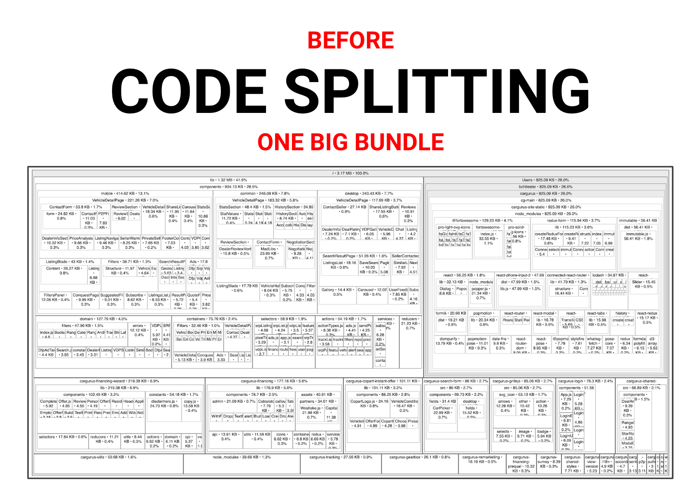
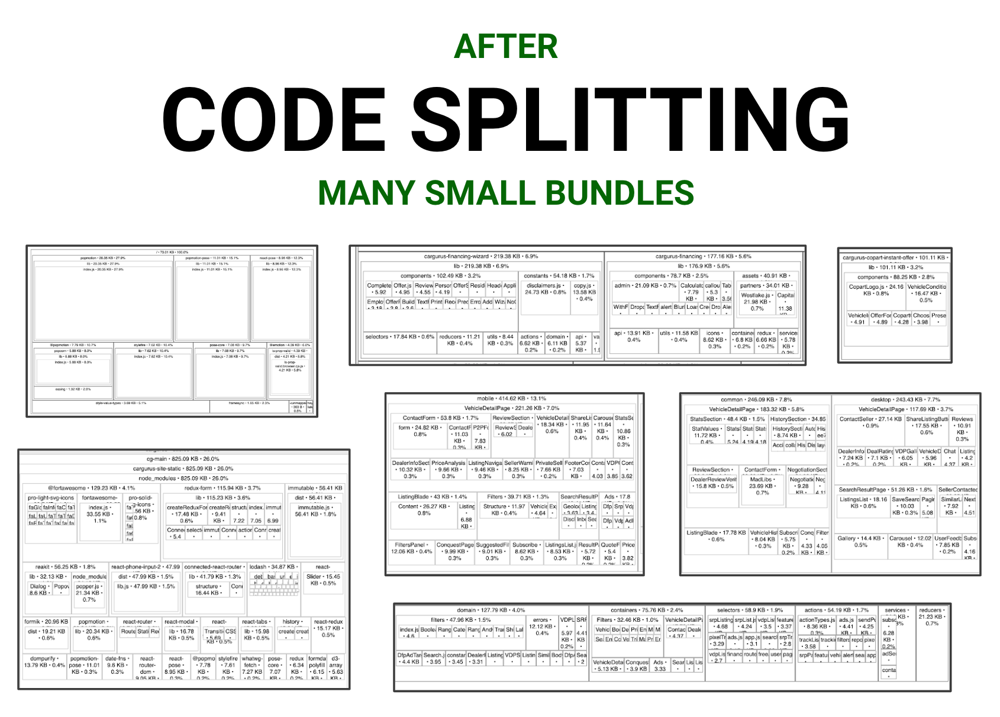
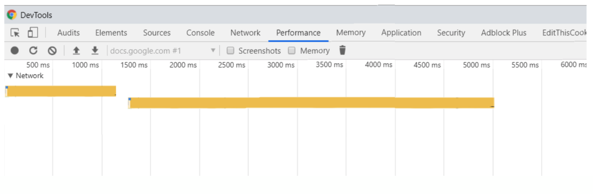
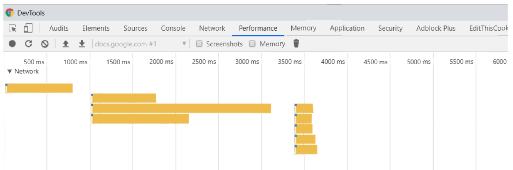

> This post refers to React applications bundled with Webpack but the method below can be applied to any application and, dare I say, aspect of our lives.

Performance is a problem that every application faces at some point. Often we start building websites without thinking much about performance haphazardly adding features as quickly as humanly possible. As a result we end up with slow applications, messy code, and piles of dependencies.

The KonMari method, developed by Marie Kondo in her book [The Life-Changing Magic of Tidying Up](https://www.amazon.com/Life-Changing-Magic-Tidying-Decluttering-Organizing/dp/1607747308/), can help save us from this mess. In her seminal work, Kondo describes a system to declutter our homes so that we may live happier, more fulfilling lives. Those who have implemented her method can attest to its “Life-Changing” capability. By eliminating clutter, practitioners bring order and intentionality to their lives. Her method doesn’t require throwing everything away and becoming a [minimalist](https://blog.usejournal.com/how-to-achieve-more-by-doing-less-steve-jobs-minimalist-approach-6a825165844f), only that we hold on to things that "spark joy" in our lives and discard everything else. In this post I will describe how to apply her method to React applications and the performance benefits that result from it.


Marie Kondo’s method is wonderfully simple and only has two steps:

1. Discard
2. Organize

Before you start however, she recommends getting a full picture of the situation. For [React](https://reactjs.org/) applications bundled with [Webpack](https://webpack.js.org/), this means using a tool such as [source-map-explorer](https://github.com/danvk/source-map-explorer#readme) or [webpack-bundle-analyzer](https://github.com/webpack-contrib/webpack-bundle-analyzer#readme) in order to get a high level view of what makes up our application. Then it is time to start discarding.


## _“When we really delve into the reasons for why we can’t let something go, there are only two: an attachment to the past or a fear for the future”_

When discarding code, start by looking for things that don’t spark joy, for example:

- Underutilized packages
- Out of date packages
- Large packages
- Underutilized features
- Duplicate code
- Large files in your own codebase

If you have a dependency that is only used in a small part of your application, consider if it is really necessary. When looking at your dependencies, [bundlephobia.com](https://bundlephobia.com/) can provide insight into how a package's size may have changed between versions and whether or not they are tree-shakable, which we will get to when we start organizing. For now though, focus on discarding and refactoring where necessary. It is important to start with discarding because it will make the next step, organizing, much easier. When you’ve finished discarding, notice how great it feels to have gotten rid of all that cruft.


Now it is time to get organized. For this step we will use [Webpack](https://webpack.js.org/) as our primary organizational tool. If you've never worked with Webpack before, don't worry, we don't need to do much in order to get some big performance boosts. Webpack is responsible for bundling our app's JavaScript based on a configuration file written in JSON. Out of the box, Webpack bundles all of our app's JavaScript into a single file, which needs to be loaded and parsed every time our site is loaded. By changing the configuration, and taking advantage of things like tree shaking and code splitting, we can organize our application into many neat and tidy bundles vastly improving our sites performance.

## _“The question of what you want to own is actually the question of how you want to live your life”_

Tree shaking enables Webpack to only pull in the parts of packages that we need. Lets look at the popular JavaScript utility library [Lodash](https://lodash.com/) for example. Without tree shaking, users are forced to download all of Lodash even though most of it will never be used. If we only need a single function from the popular Lodash library, we can import just that function without pulling in all of Lodash:

```js
//give me everything
import { debounce } from 'lodash';

//give me only debounce
import { debounce } from 'lodash/debounce';
```

Next, lets look at code splitting. Code splitting is easier than ever since the introduction of lazy loading and suspense in [React v16.6](https://reactjs.org/blog/2018/10/23/react-v-16-6.html). Without code splitting our entire application is bundled into one big JavaScript file which has to be loaded and parsed by the client before our application becomes usable. With code splitting, we can break up our bundle into smaller chunks loaded on demand so that our end users are only getting the code they need, when they need it.




So where should you code split? To start, I recommend splitting in the following areas:

- Application Routes
- Platform specific components
- Localized components

You can take advantage of code splitting almost everywhere in your app, any UI state that isn’t immediately presented to the user is a candidate for code splitting as long as you are mindful of the effect on UX. Suspense takes a fallback component as a prop which you can use to render a skeleton of the component until it loads, a pattern that is becoming increasingly common on the web. One more thing to watch out for is network request limits. In some rare cases, you can end up with so many bundles that you end up hurting performance due to these limits, which vary between browsers. Using code splitting, we can cut down on load time by only sending JavaScript over the wire when it is needed.

## Before code splitting



## After code splitting



By applying this simple method, you will end up with a much more performant application and more maintainable codebase. I found going through these steps is a great way to get to know your code on a deeper level. You will develop a new appreciation for your code and a better understanding of how your application fits together. You will also find yourself coding with more intention, maintaining organization and tidiness will feel natural.

## _“Pour your time and passion into what brings you the most joy, your mission in life.”_


