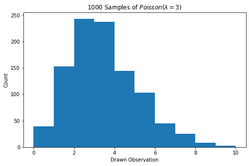

# Setup

1. Create a personal GitHub account on [GitHub](https://github.com) (Not your
    work account for Enterprise GitHub).

2. Fork the [cargurus/Blog repo](https://github.com/cargurus/Blog) to your
    account.
 
3. Clone the forked repo: 

```bash
git clone https://github.com/<insert_personal_account_name_here>/Blog.git
```

4. Install the relevant packages via `yarn` and locally host the website:

```bash
cd Blog 
yarn install
yarn start #begins local host
```

5. At this point, you should be able to access the locally-hosted blog at 
    [http://localhost:8000/](http://localhost:8000/). You can adjust the port
    from the `yarn start` command if you wish.

6. You can then create your first blog post via

```bash
yarn new:post <insert_post_name_here>
```

Which should create a blog post template in `content/blog/<insert_post_name_here>/index.md`.

# Editing/Importing

The blog document (i.e. what you will edit) is `content/blog/<insert_post_name_here>/index.md`.
This `index.md` is rendered via [Markdown](https://www.markdownguide.org) 
with some additional DS features described below. You can edit your `index.md`
in any text editor, but make sure to follow [this Markdown Style Guide](https://github.com/cargurus/Blog/blob/master/docs/markdown.md)
when editing your `index.md`.

## Importing from Jupyter Notebook

Many data scientists prefer to write data-driven documents in either
[JupyterLab or Jupyter Notebook](https://jupyter.org). Both IDEs have
robust notebook-to-Markdown converters.

We will assume that you are hosting your Jupyter
IDE at [http://localhost:8888/](http://localhost:8888/) and you want to convert
notebook `my_notebook.ipynb`. Here is how to convert it to a blog document
(i.e. an `index.md`):

1. At [http://localhost:8888/](http://localhost:8888/), launch 
    `my_notebook.ipynb` and click to 
    **File -> Export Notebook As... -> Export Notebook to Markdown**.

2. This should save the markdown and assets of the notebook
    to `~/Downloads/my_notebook.zip` (or whatever is your default download 
    directory). Unzip the directory:

```bash
unzip ~/Downloads/my_notebook.zip
```

3. Replace current blog assets with converted notebook assets:

```bash
cp -r ~/Downloads/my_notebook ~/path/to/Blog/content/blog/<insert_post_name_here>
cd ~/path/to/Blog/content/blog/<insert_post_name_here>
mv my_notebook.md index.md
```

4. Edit `index.md` with your [header](#header) (described below).

See [my notes section](#jupyter_features) for a discussion on Jupyter features
for post-writing.

## Header <a name = "header" ></a>

The header for titling/tagging the blog post will be written at the top of
`index.md`  surrounded by 3 hyphens:

```markdown
---
title: "<insert_blog_post_title>"
date: "<date_of_creation>"
author: "<cargurus_username>"
tags:
- data_science
- <any_additional_tags>
- ...
---
```

**Note**: While you can add as many tags as you wish, you must have the
`data_science` tag in tag list. This allows users to properly see your tag in
the data science navigation bar link 
([currently being constructed](https://github.com/cargurus/Blog/issues/63)).

## $\LaTeX$ via $\KaTeX$

We render $\LaTeX$ assets via the [$\KaTeX$](https://katex.org) library. This
library supports:

* __Inline Math Mode__: Typing `$a^2 + b^2 + c^2$` will render $a^2 + b^2 = c^2$.

* __Display Math Mode__: Typing 

```latex
$$
a^2 + b^2 = c^2
$$
``` 

will render

$$
a^2 + b^2 = c^2
$$

* __Mathematical fonts__: Typing `$\mathbb{R}^d$` whill render $\mathbb{R}^d$, 
    `$\mathcal{L}_x$` will render $\mathcal{L}_x$.

* __Equation Tags__: While KaTeX does not currently support `{equation}`
    environments, it emulates them via `\tag{.}` objects in display mode. For
    example, 

```latex
$$
e^{\pi i} + 1 = 0 \tag{1}
$$
``` 

will render as

$$
e^{\pi i} + 1 = 0 \tag{1}
$$

We can write a [GitHub issue of `cargurus/Blog`](https://github.com/cargurus/Blog/issues)
to implement `{equation}` environments, but they have shown to be
[historically difficult to implement](https://github.com/KaTeX/KaTeX/issues/445).

* __Some Environments__: $\KaTeX$ supports some core $\LaTeX$ environments.
    for instance, `{array}` environments are supported such that

```latex
$$
\begin{array}{cc}
b & e \\
a & r
\end{array}
$$
```

Will render as

$$
\begin{array}{cc}
b & e \\
a & r
\end{array}
$$

As another example, `{aligned}` environments are supported such that

```latex
$$
\begin{aligned}
V[X]&=E[(X - E[X])^2] \\
    &=E[(X^2 - 2XE[X] + (E[X])^2] \\
    &=E[X^2] - 2E[X]E[X] + (E[X])^2 \\
    &=E[X^2] - 2(E[X])^2 + (E[X])^2 \\
    &=E[X^2] - (E[X])^2
\end{aligned}
$$
```

Will render as

$$
\begin{aligned}
V[X]&=E[(X - E[X])^2] \\
    &=E[(X^2 - 2XE[X] + (E[X])^2] \\
    &=E[X^2] - 2E[X]E[X] + (E[X])^2 \\
    &=E[X^2] - 2(E[X])^2 + (E[X])^2 \\
    &=E[X^2] - (E[X])^2
\end{aligned}
$$

* __And More__: See the [$\KaTeX$ Supported Function Set](https://katex.org/docs/supported.html) for more details.
 
## Syntax Highlighting

As you can tell by now, the blog supports syntax highlighting of many languages.
It supports this through labeling of triple-quote (` ```  ``` `) environments
(e.g. ` ```python ``` `). Say that I write in my `index.md`:

````
```python
def fibonacci(n):
    if n == 0 or n == 1:
        return(1)
    else:
        return(fibonacci(n - 1) + fibonacci(n - 2))
```
````

This will treat all information between the triple quotes as `python` syntax,
and highlight it accordingly:

```python
def fibonacci(n):
    if n == 0 or n == 1:
        return(1)
    else:
        return(fibonacci(n - 1) + fibonacci(n - 2))
```

See the [`prism.js` documentation](https://prismjs.com/#supported-languages) for
details on all supported languages. If there is a language you would like
highlighting for that isn't currently supported,
[submit an issue on `cargurus/Blog`](https://github.com/cargurus/Blog/issuesa).

## Figures

Markdown supports embedding of figures and images. For instance, say you would
like to embed the image `pois_lambda_03.png`. You will:

1. Copy the image to your blog post current directory:

```bash
cp ~/path/to/pois_lambda_03.png ~/path/to/Blog/content/blog/<insert_post_name_here>/
```

2. Reference the image in your Markdown:

```markdown

```

This will render on the blog as such:


# Deploy Blog Post

When you are ready to submit your post to the blog:

1. Perform spell-check on the repo using `yarn check:spell`. Add any proper 
nouns to the dictionary.

2. Add information on yourself to `Blog/authors/authors.json` with some basic
info about yourself, and add a thumbnail of yourself in 
`Blog/content/assets/authors`.

3. Push your changes to your fork:

```bash
git add --all .
git commit -m "Added My Blog Post"
git push
```

4. Submit a [pull request](https://github.com/PLBMR/Blog/pulls) to __merge your
master branch into the `cargurus/Blog` master branch__.

5. Wait for approval by [Tommy Parnell](https://github.com/TerribleDev) for 
code changes and [Shannon Todesca](https://github.com/stodesca) for editorial 
sign-off.

After these steps, your blog post should be live on 
[cargurus.dev](https://www.cargurus.dev).

# Additional Notes

* __Spell-checking__: The blog requires spell-checking before being able to 
commit changes. You can launch a GUI for spell-checking your work via 
`yarn check:spell`.

* <a name = "jupyter_features"></a> __Jupyter Features__: I want to make note of 
    some Jupyter Notebook/JupyterLab IDE features for your blog writing workflow.

    + __Jupyter $\LaTeX$ Support__: Base Jupyter supports
        all $\LaTeX$ features described in this template. However,
        Jupyter's $\LaTeX$ compiles via [MathJax](https://www.mathjax.org), so
        confirm cross-compatibility of any environments with 
        [$\KaTeX$](https://katex.org) if different than environments described in
        this document.

    + __Jupyter Input Hiding__: `jupyter nbconvert` can hide code
        snippets in some exported document types through cell tagging. However,
        this converter __does not support cell hiding when exporting to
        Markdown__. Thus, if you want to hide code in the blog post, you will
        need to __explicitly delete the code block in the final `index.md`__.

* __NDA__: [Shannon](https://github.com/stodesca) is our final sign-off
to ensure no content violates CarGurus' NDAs. That being said, your forked 
repo is __on a public website__. Thus, please __do not commit changes that 
contain content that would violate your NDA if public__.

* __Feature Requests__: If you have additional feature requests for the blog
(e.g. additional syntax support, additional $\LaTeX$ environments), feel free to
[submit an issue on `cargurus/Blog`](https://github.com/cargurus/Blog/issues).

* __Blog Maintenance__: The blog is primarily owned by 
[Tommy Parnell](https:/github.com/TerribleDev) and is maintained by him and some
engineers on a voluntary basis. Thus, be conscious that feature request
fulfillment may move at different speeds at different times of the year.

* __Questions__: If you have any questions about:
    + __Engineering/Feature Requests for the Blog__: reach out to [Tommy Parnell](https:/github.com/TerribleDev).

    + __Editorial Guidelines__: reach out to [Shannon Todesca](https://github.com/stodesca).

    + __This Document__: reach out to [Michael Rosenberg](https://github.com/PLBMR).

# References

* [Markdown Guide](https://www.markdownguide.org)

* [CarGurus' Markdown Style Guide](https://github.com/cargurus/Blog/blob/master/docs/markdown.md)

* [$\KaTeX$ Supported Functions](https://katex.org/docs/supported.html)

* [`prism.js` Supported Languages](https://prismjs.com/#supported-languages)

# TODO

* Provide Details on table rendering.
